# AAID Collaboration Guidelines

## Table of Contents

- [Purpose](#purpose)
- [Glossary (Ubiquitous Language)](#glossary-ubiquitous-language)
- [AAID Workflow Structure (Meta-Diagram)](#aaid-workflow-structure-meta-diagram)
- [📐 Structural Rules (Functional Requirements)](#structural-rules-functional-requirements)
- [🎯 AAID Guiding Principles (Non-Functional Requirements)](#aaid-guiding-principles-non-functional-requirements)
- [⚡ Creating Reusable Prompts (Optional)](#creating-reusable-prompts-optional)
- [Contributing to AAID](#contributing-to-aaid)
  - [Creating a New Workflow](#creating-a-new-workflow)
  - [Improving Existing Workflows](#improving-existing-workflows)
- [Validation Checklists](#validation-checklists)
  - [Functional Requirements Validation](#functional-requirements-validation)
  - [Non-Functional Requirements Validation](#non-functional-requirements-validation)
- [Resources](#resources)

## Purpose

This document defines the structural rules and guiding principles for `AAID` workflows. It separates:

- **Functional Requirements** (Structural Rules): The observable architecture visible in rules files, workflow diagrams, and articles. These define what makes a workflow structurally _be_ `AAID`.
- **Non-Functional Requirements** (Guiding Principles): The philosophy and values that guide `AAID`'s design and use. These define `AAID`'s spirit.

Use this document when:

- **Creating new workflows**
  - _E.g. `AAID`: Refactoring_
- **Improving existing workflows**
  - _E.g. `AAID`: Acceptance Testing_

## Glossary (Ubiquitous Language)

### Core Workflow Concepts

| Term                 | Definition                                                                                                                                                                                   |
| -------------------- | -------------------------------------------------------------------------------------------------------------------------------------------------------------------------------------------- |
| **`AAID` Workflow**  | A complete development process (like TDD or Acceptance Testing) that follows the structural rules and guiding principles. Contains both Stages and Phases.                                   |
| **Workflow Diagram** | A visual representation (usually Mermaid) showing the flow of Stages, the transition point, and Phases with their internal patterns.                                                         |
| **Rules File**       | The markdown document (like `.cursor/rules/aaid.mdc`) that contains instructions for the AI, defining the workflow sequence, phases, and behavioral rules.                                   |
| **Transition Point** | The explicit moment documented in the rules file where the workflow shifts from collaborative Stages to disciplined Phases. Must be clearly stated so AI knows when to enforce strict rules. |
| **AAID Artifacts**   | Supporting documents created during AAID workflows (e.g., roadmaps, test lists, planning docs) that guide development but are not part of the application codebase itself.                   |

### Stages (Collaborative Mode)

| Term                   | Definition                                                                                                                                                                                                          |
| ---------------------- | ------------------------------------------------------------------------------------------------------------------------------------------------------------------------------------------------------------------- |
| **Stage**              | A step in the workflow using collaborative mode where developer and AI interact flexibly (e.g., understanding context, planning, aligning).  **Application codebase mutations not permitted.**            |
| **Collaborative Mode** | The operational mode during Stages where AI behavior is flexible, conversational, and exploratory. **Application codebase mutations not permitted.** AAID artifacts (roadmaps, test lists) may be created/modified. |

### Phases (Disciplined Mode)

| Term                            | Definition                                                                                                                                                                                                                             |
| ------------------------------- | -------------------------------------------------------------------------------------------------------------------------------------------------------------------------------------------------------------------------------------- |
| **Phase Cycle**                 | The sequence of phases that repeat in the disciplined mode (e.g., Red → Green → Refactor in TDD, which cycles for each test).  **Application codebase mutations permitted with mandatory review checkpoints.**               |
| **Phase**                       | A single named step in the phase cycle (e.g., Red, Green, Refactor). Each phase has its own purpose but follows the workflow's internal pattern. Phases exist within a Stage (e.g., Stage 4 contains Red/Green/Refactor).              |
| **Internal Phase Pattern**      | The sequential steps that happen INSIDE each individual phase (e.g., `Collaborate → Verify → Handle Issues → Review`). All phases within a workflow must use the same internal pattern.                                                |
| **Disciplined Mode**            | The operational mode during Phases where AI behavior is strict and rule-enforced, like a state machine. AI must follow exact sequences and cannot skip steps. **Application codebase mutations permitted with mandatory supervision.** |
| **Review Checkpoint**           | A mandatory stop point where AI must present work and wait for developer approval before proceeding. Marked as `⏸️ AWAIT USER REVIEW` in phases.                                                                                       |
| **Verification**                | The step where AI executes commands on the developer's system to confirm success (e.g., running tests, building code). Produces concrete pass/fail results, not just AI reasoning.                                                     |
| **Markdown Instruction Format** | The documentation template structure used in the rules file to teach AI what to do in each phase (e.g., Triggers, Core Principle, Instructions, etc.). Must be identical for all phases within a workflow.                             |

## AAID Workflow Structure (Meta-Diagram)

This abstract diagram shows the structural requirements that any AAID workflow must follow. Each workflow implementation defines its own specific stages, phases, and internal patterns within this framework.

```mermaid
graph TD
    Start["🚀 **Any AAID Workflow**"]

    Start --> CollabZone["**COLLABORATIVE MODE**<br/><br/><i>Stages 1 through N</i><br/><br/>Flexible, conversational interaction<br/>Number and purpose varies by workflow"]

    Ex1["<i>TDD example:</i><br/>Stage 1: Context<br/>Stage 2: Planning<br/>Stage 3: TDD Begins<br/>Stage 4: TDD Cycle"]
    CollabZone -.- Ex1

    CollabZone --> Transition["⚡ **TRANSITION POINT**<br/><br/>Explicitly documented switch<br/>from collaborative to disciplined mode"]

    Transition --> DisciplinedZone["**DISCIPLINED MODE**<br/><br/><i>Stage X: Phase Cycle</i><br/><br/>Strict rules, mandatory sequences<br/>Review checkpoints enforced"]

    DisciplinedZone --> PhaseCycle["**Phase Cycle**<br/><br/>Contains 2+ phases<br/><i>Number and names vary by workflow</i>"]

    Ex2["<i>TDD example:</i><br/>Red → Green → Refactor<br/>(repeats for each test)"]
    PhaseCycle -.- Ex2

    PhaseCycle --> PhaseBox["**Each Phase**"]

    PhaseBox --> Pattern["**Internal Pattern**<br/><br/>Sequential steps that all phases follow<br/><i>(Same pattern for all phases in workflow)</i><br/><br/>Step 1 → Step 2 → ... → Review ⏸️"]

    Ex3["<i>TDD example:</i><br/>Collaborate → Verify<br/>→ Handle Issues → Review"]
    Pattern -.- Ex3

    Pattern --> Review{"User<br/>Review"}
    Review -->|Reject| Pattern
    Review -->|Approve| NextPhase["Next Phase<br/>or<br/>Cycle Repeat"]

    NextPhase --> Complete["✨ **Complete**<br/><br/>When cycle criteria met"]

    %% STYLES
    style Start fill:#f9f9f9,stroke:#333,stroke-width:4px,color:#000

    style CollabZone fill:#e3f2fd,stroke:#1976d2,stroke-width:4px,color:#000
    style Transition fill:#ffd54f,stroke:#f57c00,stroke-width:5px,color:#000
    style DisciplinedZone fill:#f3e5f5,stroke:#7b1fa2,stroke-width:4px,color:#000

    style PhaseCycle fill:#e1bee7,stroke:#7b1fa2,stroke-width:3px,color:#000
    style PhaseBox fill:#fff9c4,stroke:#666,stroke-width:2px,color:#000
    style Pattern fill:#ffebee,stroke:#d32f2f,stroke-width:2px,color:#000
    style Review fill:#fff9c4,stroke:#f9a825,stroke-width:3px,color:#000
    style NextPhase fill:#f5f5f5,stroke:#666,stroke-width:2px,color:#000
    style Complete fill:#4caf50,stroke:#2e7d32,stroke-width:4px,color:#fff

    style Ex1 fill:#e8f5e9,stroke:#4caf50,stroke-width:2px,stroke-dasharray: 5 5,color:#2e7d32
    style Ex2 fill:#e8f5e9,stroke:#4caf50,stroke-width:2px,stroke-dasharray: 5 5,color:#2e7d32
    style Ex3 fill:#e8f5e9,stroke:#4caf50,stroke-width:2px,stroke-dasharray: 5 5,color:#2e7d32
```

**What This Diagram Shows:**

- **Collaborative Mode**: Flexible stages (purpose varies by workflow); application codebase mutations not permitted, but AAID artifacts (roadmaps, test lists) may be created
  - _TDD example: Stages 1-4, with 1 (Context), 2 (Planning), 3 (Test List) collaborative, then transition to 4 (TDD Cycle) disciplined_
- **Transition Point**: Explicit switch to disciplined mode where application codebase mutations become permitted (Rule 1)
- **Disciplined Mode**: Phase cycle with strict rules, review checkpoints, and supervised application codebase mutations
- **Phase Cycle**: Multiple phases that repeat until work is complete
  - _TDD example: Red → Green → Refactor (repeats for each test)_
- **Internal Pattern**: Same sequential steps inside every phase (Rule 2)
  - _TDD example: Collaborate → Verify → Handle Issues → Review_
- **Review Checkpoints**: Mandatory stops for user approval before proceeding to next phase

Each AAID workflow (TDD, Acceptance Testing, Refactoring, etc.) implements this structure with its own specific:

- Collaborative stage purposes
- Phase cycle names and count
- Internal pattern steps

## 📐 Structural Rules (Functional Requirements)

These rules define the observable architecture of `AAID` workflows, visible in rules files, workflow diagrams, and articles. They determine what makes a workflow structurally _be_ `AAID`. Without these, it's something else.

| Rule                                    | What It Defines                                                                           |
| --------------------------------------- | ----------------------------------------------------------------------------------------- |
| **Rule 1: Stages vs Phases**            | Two operational modes: flexible collaboration vs strict discipline, with transition point |
| **Rule 2: Internal Phase Pattern**      | All phases within a workflow follow the same sequential steps                             |
| **Rule 3: Instruction Markdown Format** | All phases within a workflow use identical AI instruction format                          |

📖 **[Read the guide on Structural Rules →](functional-requirements/structural-rules.md)**

## 🎯 AAID Guiding Principles (Non-Functional Requirements)

These principles represent the philosophy and values that guide `AAID`'s design and use. They're not structurally enforced like the core rules, but they define `AAID`'s spirit. A workflow can technically function as `AAID` without following these principles, but it won't embody what `AAID` stands for.

| Principle                                          | What It Means                                              |
| -------------------------------------------------- | ---------------------------------------------------------- |
| **Principle 1: Technology Agnosticism**            | Workflows describe _what_, never _how_ with specific tools |
| **Principle 2: Developer Mindset**                 | Engaged comprehension and incremental progress             |
| **Principle 3: Standing on Giants' Shoulders**     | Build on proven methodologies, not AI novelty              |
| **Principle 4: The Future We're Building Towards** | Design for conversation-speed human orchestration          |

📖 **[Read the guide on Guiding Principles →](non-functional-requirements/guiding-principles.md)**

## ⚡ Creating Reusable Prompts (Optional)

Reusable prompt commands (like `/red-&-stop`) are optional tools that speed up workflows and help steer AI back on track when it forgets rules. They're useful for repetitive prompts, phase transitions, and context gathering, and many other cases.

**Stage commands** guide exploration; **Phase commands** enforce discipline and review checkpoints. Commands reference the rules file as single source of truth.

📖 **[Read the guide on Creating Reusable Prompts →](reusable-prompts/creating-reusable-prompts.md)**

## Contributing to AAID

### Creating a New Workflow

Follow these steps to create a workflow that meets both functional requirements (structural rules) and non-functional requirements (guiding principles).

#### 1. Analyze Your Domain

- What problem are you solving?
- What needs collaboration (Stages) vs discipline (Phases)?
- Where is the transition point?

#### 2. Apply Structural Rules (FR)

Design your workflow architecture:

- **Rule 1: Document Transition Point**

  - Explicitly state when the workflow shifts from Stages to Phases
  - Example: "Stages 1-3 use normal AI assistance. Stage 4 enforces strict [workflow name] discipline."

- **Rule 2: Design Internal Phase Pattern**

  - Define the sequential steps inside each phase: `[Step 1] → [Step 2] → [Step 3] → ...`
  - This pattern must be identical for all phases in your workflow

- **Rule 3: Choose Phase Markdown Structure**
  - Use identical markdown structure for all phases
  - Recommended sections: Triggers, Core Principle, Instructions, On Success, On Error, Next Phase

#### 3. Apply Guiding Principles (NFR)

Ensure your workflow embodies `AAID`'s philosophy:

- **Technology Agnosticism**: Avoid naming specific tools. Focus on what needs to happen, not how.
- **Developer Mindset**: Include review checkpoints; keep phases incremental.
- **Standing on Giants' Shoulders**: Base design on proven methodologies; cite the foundations you're building on.
- **The Future We're Building Towards**: Design for rapid human-AI cycles; use simple commands ready for voice input.

#### 4. Create Rules File

Write the AI instructions file (e.g., `.cursor/rules/your-workflow.mdc`) containing:

- Workflow sequence documentation (Stages 1-X with transition point)
- All phase definitions using your chosen markdown structure (Rule 3)
- Recognition triggers so AI knows when this workflow is active

#### 5. Create Workflow Diagram

Use [Mermaid Live Editor](https://mermaid.live/) showing Stages, transition point, and Phases with internal pattern.

#### 6. Write Human-Readable Article

Create a comprehensive guide (like the [Main `AAID` Guide](https://github.com/dawid-dahl-umain/augmented-ai-development/blob/main/docs/aidd-workflow.md)) that teaches developers how to use this workflow. The article should:

- Explain the workflow's purpose and when to use it
- Walk through each stage and phase with examples
- Show real-world application with code samples
- Reference the established methodology you're building on (Standing on Giants' Shoulders)

### Improving Existing Workflows

1. **Identify which rule or principle your improvement relates to** (FR or NFR)
2. **Show before/after** (diagram updates, rules file changes)
3. **Validate consistency**: If changing one phase, must others change too? (Rules 2 & 3 require consistency within a workflow)
4. **Ensure philosophical alignment**: Does the improvement maintain `AAID`'s guiding principles?

## Validation Checklists

Once you've created your workflow artifacts (rules file, diagram, article), use these checklists to verify completeness.

### Functional Requirements Validation

**These MUST all pass for a workflow to be considered `AAID`.**

| Rule                                    | Validation Question                                                            | ✓   |
| --------------------------------------- | ------------------------------------------------------------------------------ | --- |
| **Rule 1: Stages vs Phases**            | Is the transition point from Stages to Phases explicitly documented?           | ☐   |
| **Rule 2: Internal Phase Pattern**      | Do all phases follow the same internal pattern (visible in workflow diagrams)? | ☐   |
| **Rule 3: Instruction Markdown Format** | Do all phases use identical markdown structure in the rules file?              | ☐   |

### Non-Functional Requirements Validation

**These SHOULD be followed to maintain `AAID`'s philosophy and values.**

| Principle                                          | Validation Question                                                          | ✓   |
| -------------------------------------------------- | ---------------------------------------------------------------------------- | --- |
| **Principle 1: Technology Agnosticism**            | Does the workflow avoid prescribing specific tools/frameworks/architectures? | ☐   |
| **Principle 2: Developer Mindset**                 | Does the workflow enforce review checkpoints and incremental progress?       | ☐   |
| **Principle 3: Standing on Giants' Shoulders**     | Can you identify which established practices influenced this design?         | ☐   |
| **Principle 4: The Future We're Building Towards** | Does the workflow support rapid, voice-ready human-AI cycles?                | ☐   |

## Resources

- [Main `AAID` Guide](https://github.com/dawid-dahl-umain/augmented-ai-development/blob/main/docs/aidd-workflow.md)
- [`AAID`: TDD Diagram](https://github.com/dawid-dahl-umain/augmented-ai-development/blob/main/aaid-workflow-diagram.mermaid)
- [`AAID`: Acceptance Testing Diagram](https://github.com/dawid-dahl-umain/augmented-ai-development/blob/main/appendices/appendix-a/aaid-at-workflow.diagram.mermaid)
- [Demo Repository](https://github.com/dawid-dahl-umain/augmented-ai-development-demo)
